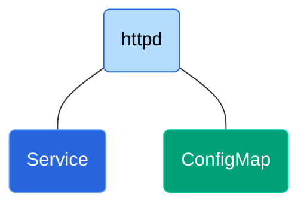
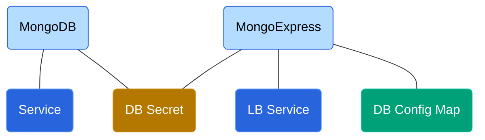
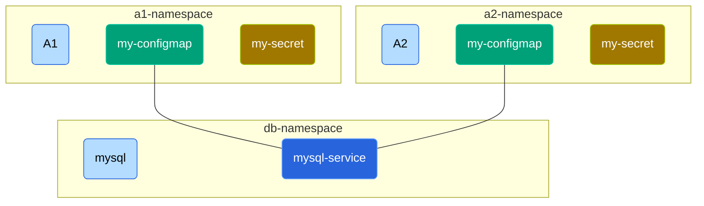
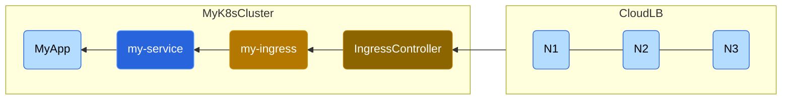
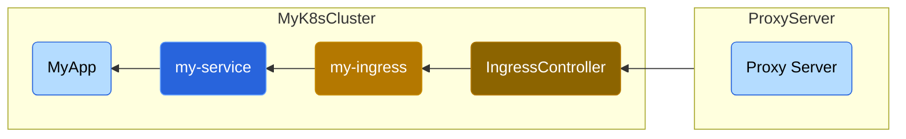
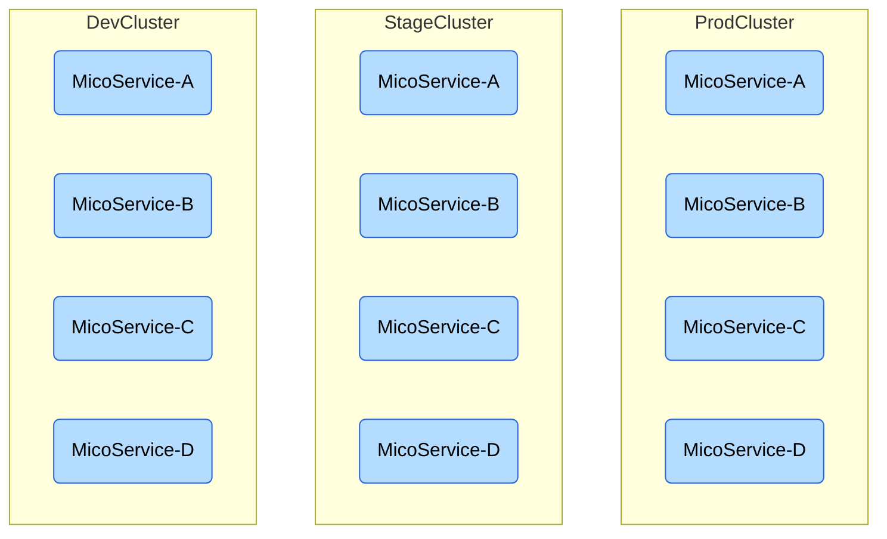



# Introduction

Kubernetes is an open source, **container orchestration** tool that operates in a **distributed** environment at **scale**. Kubernetes comes from the Greek word that means *"The person who steers the ship"*. Hence the logo.

> K8s is short for Kubernetes

## What is Container Orchestration?

The rise of micro-services required an environment where each service/application could run in its own virtual environment with its bare minimum system libraries -- This resulted in container architecture  -- Docker being the most popular. A container orchestration framework like K8s provides

- High Availability -- Zero downtime.
- Scalability -- Ability to take more load or less load on need basis.
- Self healing -- Ability to recover from failures.

## Terminologies

| Term             | Detail                                                       |
| ---------------- | ------------------------------------------------------------ |
| Node             | A Kubernetes Node is any Linux host $$-$$ VM, bare metal or even private/public cloud instance. |
| Pod              | Smallest unit of K8s that provides abstraction over container. A pod is for K8s as container is for Docker. K8s is **not** coupled with Docker. <br />K8s provides an abstraction so that user interacts with K8s layer and doesn't need to directly interact with the container provider. Docker can be replaced with any other container runtime that meets the spec. |
| K8s Cluster      | Used interchangeably as just Kubernetes, is made up of master and worker nodes. |
| Microservice App | A microservice app is an application made up several independent parts called **services.**. The services work together to create a meaningful application. |
| K8s Master Node  | A collection of services that make up the control panel and are in-charge of the K8s cluster. Master schedules apps, monitors worker nodes, implements changes and responds to events. |
| K8s Worker Node  | The app services run on the K8s worker node or just node.    |
| Deployment       | A YAML manifest file that answers (A) What the app needs? (B) Scale $$-$$ How many replica apps? |

# Core components

## Node

A node is a physical machine or a virtual machine (VM).

## Container

A container is like a womb for an application (app). It contains only those system and app libraries that are required to run the app. It provides the app with an environment as if the app is running in its own machine (node).

## Pod

A pod is a K8s component that provides an abstraction layer over the container. The user interacts with the pod and not directly with the container. This way, the container provider can be replaced with any other container provider that follows the spec. Docker is the most popular container provider.

- Pod should usually contain one application (app).
- Pod could have other small helper apps that work coherently with each other.
- Pod (not container) gets its own internal IP.
- Pods can communicate with each other using **internal** IP address
- Pods are ephemeral -- Pod can die due to node crash, container crash, resource got exhausted resulting in crash or pod  got relocated to another node.
- When a pod dies, it is recreated. Thus recreated pod can reside in any node and it gets another IP.
- Pods **cannot rely on communicating with internal IP** as it can change and is not reliable. This is solved using another K8s component called Service.

## Service

A service is a K8s component that can be attached to each Pod.

- The service provides a permanent IP address.
- Pods communicate with each other via their services.
- The lifecycle of Pod and service are not connected. So, even if the Pod dies, the service will stay.
- An **external service** needs to be created to expose the Pod for web requests.
- An **internal service** is used for inter Pod communication
- An external service URL with look like `http://<node-ip>:<port>`. However, we want the URL to look like `http://app-name`. This is achieved using a K8s component called **Ingress**.
- External request goes to Ingress which then forwards the request to the corresponding service.
- Internally Pods communicate using the service.

## Ingress

A ingress is the end-point for external browser requests to route traffic into the K8s cluster. Ingress provides a way to access service using the service name like `http://app-name`

## ConfigMap

Let's say we need to change a container configuration (Like Apache log verbosity). One way of achieving this is to modify the container files, push a new version of container (say to docker-hub), ask K8s to upgrade to the new version of the container. This is very tedious for every small config change to be done.

K8s provides a more elegant solution via ConfigMap

- ConfigMap contains the configuration of the component
- ConfigMap is attached to the Pod
- The ConfigMap object is updated for any config change to be done.
- Even if the pod crashes, it shall be restarted and will start running with the config as per ConfigMap

> Don't put credentials in ConfigMap. Use Secret.

## Secret

A container configuration can also be something like login credentials. Creating a ConfigMap for this case will be insecure as ConfigMap is plain text. This is handled using K8s component **Secret**.

- Secret is Base64 encoded.
- Secret is attached to a Pod just like ConfigMap.
- The value in secret can be accessed inside the application as environment variable or properties file.

> Credentials and certificates are stored as Secret

## Volume

When a pod dies, the data that the pod has generated dies with it. This data could be less significant data like log or a lot more significant data like database entries. In order to persist the data even after pod's reincarnation we need another K8s component called **Volumes**.

>  A volume abstracts storage that is attached to the pod

This storage could be on the same Node, a remote storage on some other node, a cloud storage

> **Note:** A storage has be visualised as external to the K8s cluster. K8s does not manage data persistance!

This means a user and/or administrator is responsible for the following storage management

- Data distribution -- Spread chunks of data across physical nodes
- Data redundancy -- Maintain multiple copies of data
- Ensure data is kept on reliable hardware (with parity check) from which it can be restored.

## Replicas

With the setup the service is accessible via a external browser. If a pod dies, it gets recreated. However, there is a window of time between crash and recreation where the service is unavailable. In order to provide high availability, that is zero down time of a service, we need multiple replicas of the pod running (preferably distributed on different nodes).

- Multiple replicas of the pod shall be connected to the **same** service object.
- The service provides a persistent static IP address with DNS name, that remains even if pod dies and gets recreated.
- The service also provides a built-in load balancer that distributes load among pods.

> A service provides persistent static IP as well as built-in load balancing.

Replicas are not manually created by creating multiple pods. Instead we configure our requirements in a YAML file (desired state) and create a K8s component called **Deployment**.

## Deployment

A deployment is a K8s component that provides another layer of abstraction on top of pods -- Pods are an abstraction over containers. Deployment provide an easy way to configure, create, replicate, scale-up and scale-down pods. In practice, we mostly work with deployments and not directly with pods.

> Do not use Deployment to create database pods or any pod that has to maintain state. Use StatefulSet.

## StatefulSet

A deployment cannot be used in case of stateful applications such as database.

A stateful application has the following complications in case of multiple pods (say database pods)

- To maintain consistency they could be accessing the same database storage. In this case multiple pods will try read and write that needs be syncronized.
- If we have a database storage per pod, then these storages must be in sync.

A mechanism that governs which pod shall write to the storage, which shall read is required in addition to replicating feature. This is offered by K8s component called **StatefulSet**. As the name indicates a StatefulSet is meant specifically for applications like databases (like MySQL, MongoDB, ElasticSearch).

> Pods that need to maintain state should be created using **StatefulSet**.

Like Deployment, StatefulSet also takes care of configuration, replication, scale-up and scale-down (while avoiding database inconsistencies). Deploying database apps using StatefulSet in K8s cluster is much more tedious than deployment. So, it is common practice to **host database outside K8s cluster**.

# Architecture


## Worker Nodes

Each K8s worker node will have multiple pods running on it. The worker nodes do most of the work and hence the name.

Every worker nodes must have the following **three** processes running

- Container runtime -- The most popular container runtime is Docker.
- Kubelet -- A K8s process that schedules the pods in the nodes. Kubelet is responsible for running the pod inside the node and assigning resources from the node to the pod. So Kubelet manages the node and the container runtime.
- Kube Proxy -- We said a K8s service, with a static IP shall load-balance among pod distributed in multiple nodes. The service actually goes via the kube-proxy. If a source pod is making a request to access another target pod via service. The service prioritises a target  pod running on the same node thus reducing network overhead.

## Master Nodes

Master Nodes take care of the following

- Interacting with the worker nodes
- Adding and removing nodes from the K8s cluster
- Monitor the pods
- Re-order or recreate pods across nodes

Every master node has the following **four** process running

- API Server
  - A user interacts with the API server using some client -- The client could be K8s UI dashboard, kubelet CLI or K8s APIs
  - API server acts as **cluster gateway** -- Gets initial request of any updates or query from the client.
  - API server acts as **gatekeeper** -- Ensure Authenticated requests get through to the cluster.
  - Any request first reaches API Server, gets validated and is then forwarded to other process on the master nodes.
  - Any monitoring request/query regarding **status or health of the deployment** happens via API Server
  - This is good for security as there is only **one entry point** into the cluster.
- Scheduler
  - Say, we want to start a new pod. The request goes to API Server which then forwards the request to Scheduler
  - The Scheduler shall start the pod on the worker node.
  - The Scheduler has the **intelligence** to pick the worker node for a given pod and does not just do it randomly. For example, the scheduler looks at the resources required by the pod, the available resources on each worker node, the type of pods already running on each worker node etc to pick the target worker node.
  - The Scheduler only picks the target node. The process that actually starts the pod is the Kubelet running on that worker node.
- Controller Manager
  - **Detect state changes**  -- For example, pods die on any node
  - After detection, the control manager shall contact the scheduler to schedule the pod creation.
  - The control manager thus detects state changes and ensures state is maintained.
- etcd
  - A key-value store of the K8s cluster state -- It can be considered as the **cluster brain**.
  - All changes of pod's death, recreation etc are all stored in etcd.
  - All this mechanism of scheduler, controller manager **works based on the data** stored in etcd.
    - How does Scheduler know what resources are available on which worker node?
    - How Controller Manager know that the cluster state changed -- pod died or Kubelet restarted a pod etc?
    - How does API Server know about the health/status of a deployment?

A K8s cluster is typically made up of multiple master nodes each running all these processes.

- The API server is load balanced across master nodes
- etcd forms a distributed storage across all the master nodes

## Master Vs worker Nodes

Master nodes require less resources. Worker nodes do the actual work and may need more resources and more instances. A small cluster deployment may have two master and three worker nodes.

A master/worker node is added as follows

- Get a bare metal server
- Install corresponding master/worker processes
- Add the node to the K9s cluster

# Single node cluster

## Minikube

A production cluster have multiple (at-least 2) master nodes and several worker nodes (at-least 3). However to setup a cluster on a local machine (laptop) we can use an open source tool called minikube.

Minikube creates a single node K8s cluster with master and worker processes for testing purposes.

## Kubectl

We have seen that **API Server** component of of K8s Master is the entry point for interacting with K8s to perform any operation. We can interact with the API Server using

- Kubernetes UI dashboard
- Kubernetes API
- Kubectl CLI

The Kubectl CLI is the most popular and powerful way of interaction with K8s cluster be it Minikube, production cluster, AWS, google cloud or even hybrid cluster.

## Installation

[Install Docker on Ubuntu](https://docs.docker.com/engine/install/ubuntu/)

[Install Minikube](https://minikube.sigs.k8s.io/docs/start/)

## Verify Installation

```bash
> docker --version
Docker version 20.10.21, build baeda1f

> minikube version
minikube version: v1.28.0
commit: 986b1ebd987211ed16f8cc10aed7d2c42fc8392f

> kubectl version --output=yaml
clientVersion:
  buildDate: "2022-10-12T10:57:26Z"
  compiler: gc
  gitCommit: 434bfd82814af038ad94d62ebe59b133fcb50506
  gitTreeState: clean
  gitVersion: v1.25.3
  goVersion: go1.19.2
  major: "1"
  minor: "25"
  platform: linux/amd64
kustomizeVersion: v4.5.7
serverVersion:
  buildDate: "2022-10-12T10:49:09Z"
  compiler: gc
  gitCommit: 434bfd82814af038ad94d62ebe59b133fcb50506
  gitTreeState: clean
  gitVersion: v1.25.3
  goVersion: go1.19.2
  major: "1"
  minor: "25"
  platform: linux/amd64

> minikube start
minikube v1.28.0 on Ubuntu 22.04
...
...
Done! kubectl is now configured to use "minikube" cluster and "default" namespace by default

> kubectl get nodes
NAME       STATUS   ROLES           AGE   VERSION
minikube   Ready    control-plane   10h   v1.25.3

> minikube status
minikube
type: Control Plane
host: Running
kubelet: Running
apiserver: Running
kubeconfig: Configured

```

## Kubectl core commands

### Basic commands

```bash
# First off, start the K8s cluster
> minikube start

# A set of master nodes is called a control-pane
> kubectl get nodes
NAME       STATUS   ROLES           AGE   VERSION
minikube   Ready    control-plane   10h   v1.25.3

# Note there are no pods
> kubectl get pods
No resources found in default namespace.

> kubectl get services
NAME         TYPE        CLUSTER-IP   EXTERNAL-IP   PORT(S)   AGE
kubernetes   ClusterIP   10.96.0.1    <none>        443/TCP   10h

```

### CRUD of K8s component

In this case we are looking at the CRUD operations on the Deployment K8s component. The same applies to other K8s components as well.

```bash
# Usage
kubectl create deployment NAME --image=image -- [COMMAND] [args...] [options]
kubectl (edit|delete) deployment NAME

# Create deployment
# -----------------
> kubectl create deployment httpd --image=httpd
deployment.apps/httpd created

# Status: Deployment not yet ready
> kubectl get deployments
NAME        READY   UP-TO-DATE   AVAILABLE   AGE
httpd   0/1     1            0           12s

# Status: Deployment now ready
> kubectl get deployments
NAME        READY   UP-TO-DATE   AVAILABLE   AGE
httpd   1/1     1            1           42s

# Status: Get replica sets of the deployment
> kubectl get replicasets
NAME                   DESIRED   CURRENT   READY   AGE
httpd-574c8fb7c5   1         1         1       115s

# Status: Get pods -- Note that the replicaset name is prefixed to the pod's name
> kubectl get pods
NAME                         READY   STATUS    RESTARTS   AGE
httpd-574c8fb7c5-k9nh6   1/1     Running   0          90s

# Debug: Log of pods
# ------------------
> kubectl logs httpd-574c8fb7c5-k9nh6
AH00558: httpd: Could not reliably determine the server's fully qualified domain name, using 172.17.0.5. Set the 'ServerName' directive globally to suppress this message
[Wed Dec 07 04:34:40.810356 2022] [mpm_event:notice] [pid 1:tid 140054806654272] AH00489: Apache/2.4.54 (Unix) configured -- resuming normal operations

# Debug: Get interactive terminal
# -------------------------------
> kubectl exec -it httpd-574c8fb7c5-k9nh6 -- bash

# Edit deployment
# -----------
> kubectl edit httpd

# Delete deployment
# -----------------
> kubectl delete httpd
deployment.apps "httpd" deleted
```

# Basic deployment with service




The [K8s/01-basic](K8s/01-basic) project details the following concepts

- Deployment, replicas, pods and service
- Accessing via Node IP, internal Service IP and Pod IP
- Assert service load balancing, self healing of pods, scaling of pods
- Assert Service IP and ConfigMap persistance
- Test out-of-box Zero downtime when pod is deleted during load

# MongoDB & MongoExpress deployment



The [K8s/02-mongo](https://github.com/cafeduke/learn/tree/master/K8s/02-mongo) project details the following concepts

- Secret and ConfigMap
- Deployments sharing Secret component
- Request flow through pods and services when user accesses MongoExpress UI

# Namespace

Namespaces are used to group resources inside a K8s cluster. Like any namespace it avoids name conflict.

## Built-in namespaces

By default K8s provides the following namespaces

| Namespace            | Comment                                                      |
| -------------------- | ------------------------------------------------------------ |
| kubernetes-dashboard | Specific to minikube. Not present in standard cluster        |
| kube-system          | Do **not** use or modify this. This is not meant for user. <br />The components deployed are system processes. |
| kube-public          | Data accessible by public. <br />It has `ConfigMap` with cluster information that can be accessed without authentication. <br />Execute `kubectl clusterinfo` to see details. |
| kube-node-lease      | A recent addition. Holds information about heartbeat of nodes indicating availability. |
| default              | This is the namespace used when none is specified.           |

## Custom namespace

Various K8s components (Deployments, ConfigMap, Secret) can be grouped under a custom namespace by specifying the name of the namespace in `metadata.namespace`

```yaml
apiVersion: v1
kind: ConfigMap
metadata:
  name: my-configmap
  namespace: my-namespace
data:
  ...
```

## Use of namespace

- **Avoid Cluttering:** Group components into namespaces based on functionality. Eg: Database, Monitoring, LB, Logging
- **Multiple teams using same cluster:** Avoid accidental overwriting of components having same name.
- **Resources sharing in same cluster:** We can have staging and development environments share namespaces like Logging (ElasticStack) and LB(Nginx-Ingress Controller). This avoids creating redundant components for staging and development separately.
- **Blue-Green Deployment:** Similar to staging and development. Blue is environment under development and green is the current environment.
- **Limit access and resources via namespace**: Configure access such that, members of projectA-namespace, for example, cannot access components in projectB-namespace.  Provide resource quota (CPU, RAM, Storage) per namespace. This way one team will not hog most resources of the K8s cluster.

## Sharing between namespaces

One namespace cannot refer to most components (ConfigMap, Secret) in another namespace




- We have a `my-configmap` that references the DB service in `mysql-service` in `a1-namespace`. This `ConfigMap` cannot be used by `a2-namespace`. It will have to create another copy of `ConfigMap` component even though the contents are same.
- Similarly, secrets cannot be shared between namespaces even though the contents are same.
- However, `my-configmap` in both namespaces refer the same DB service `mysql-service` which is in `db-namespace`


```yaml
##
# my-configmap
# ------------
# data.db_url
#   - Note that fully qualified name is used to reference the service
#   - The fully qualified service name is of the format <service-name>.<namespace>
##
apiVersion: v1
kind: ConfigMap
metadata:
  name: my-configmap
data:
  db_url: mysql-service.db-namespace
```

## Global Components

Global components cannot be confined to a namespace. Example of such components are as follows

- Volumes
- Node

```bash
# List all global components
> kubectl api-resources --namespaced=false

# List all components that can be namespaced
> kubectl api-resources --namespaced=true
```

## Kubectl and namespace

By default, `kubectl`  will list components in the `default` namespace. For `kubectl` to work with custom namespace use the `-n` option of `kubectl`  as shown below.

```bash
> kubectl get pods -n my-namespace
```

>  The default behaviour can be changed using a third party tool called **kubens**

# Ingress

Consider a simple K8s cluster with a deployment and service (See  [K8s/01-basic](K8s/01-basic) project for example). Here, the service is exposed to external request by configuring the `type: LoadBalancer` and exposing `nodePort: 30000`. The service was accessed using the NodeIP (minikube ip)

Ideally a K8s cluster must be as follows

- The service should **not** expose external port (via LB external service)
- The service should be accessible via a domain name
- The service should be accessible via HTTPS protocol

## Ingress Component

Ingress provides routing rules and is the entry point into the K8s cluster.

```yaml
##
# spec.rules
#   - When request comes to host route the request to "backend" service
#   - In this case the backend service is myapp-internal-service
#   - Since it's internal service we use internal service port
#   - The service is of defualt type (ClusterIP) and the nodePort config is removed
##
apiVersion: networking.k8s.io/v1beta1
kind: Ingress
metadata:
  name: myapp-ingress
spec:
  rules:
    - host: myapp.com
      http:
        paths:
          - backend:
              serviceName: myapp-internal-service
              servicePort: 8080
```

## Ingress Controller

An Ingress Component is not enough for the Ingress routing rules to work. We also need an **Ingress Controller**.

- An Ingress Controller is the actual implementation of Ingress.
- An Ingress Controller is a pod (or set of pods) within K8s cluster that evaluate and process routing rules
- An Ingress Controller manages all traffic, **redirects requests** to corresponding service.
- An Ingress Controller is the single **entry point** into the cluster.
- There are many third party implementations of Ingress Controller. The K8s implementation is `K8s Nginx Ingress Controller`


## External Cloud LB deployment

This is the typical deployment of a K8s cluster.

- An external cloud loadbalancer (LB) shall front-end all customer requests and shall forward the request to `IngressController`
- The LB shall have a public IP registered with domain `my-app.com`




## External Proxy Server deployment

The deployment uses an external proxy server

- An external proxy server could be a hardware or software solution.
- The proxy shall be the only entry point to customer requests and shall forward the request to `IngressController`
- The proxy shall have a public IP registered with domain `my-app.com`



## MiniKube deployment

### Enable Ingress Controller

```bash
# Automatically starts the K8s-Nginx implementation of Ingress Controller
> minikube addons enable ingress

# List namespaces
> kubectl get namespaces
NAME              STATUS   AGE
default           Active   6d20h
ingress-nginx     Active   4m11s
kube-node-lease   Active   6d20h
kube-public       Active   6d20h
kube-system       Active   6d20h

# K8s IngressController runs in ingress-nginx namespace
# Note: ingress-nginx-controller-5959f988fd-76rbx
> kubectl get pods -n ingress-nginx
NAME                                        READY   STATUS      RESTARTS   AGE
ingress-nginx-admission-create-ml8t8        0/1     Completed   0          4m3s
ingress-nginx-admission-patch-7vjd6         0/1     Completed   0          4m3s
ingress-nginx-controller-5959f988fd-76rbx   1/1     Running     0          4m3s

```

## Dashboard for K8s

### Enable dashboard

```bash
> minikube dashboard

> kubectl get ns
NAME                   STATUS   AGE
default                Active   6d20h
ingress-nginx          Active   9m22s
kube-node-lease        Active   6d20h
kube-public            Active   6d20h
kube-system            Active   6d20h
kubernetes-dashboard   Active   2m17s

> kubectl get services -n kubernetes-dashboard
NAME                        TYPE        CLUSTER-IP       EXTERNAL-IP   PORT(S)    AGE
dashboard-metrics-scraper   ClusterIP   10.100.197.148   <none>        8000/TCP   3m41s
kubernetes-dashboard        ClusterIP   10.109.91.91     <none>        80/TCP     3m41s

```

### Configure Ingress

```yaml
##
# Ingress
# -------
# metadata.namespace
#   - We need to use this to specify that we are using 'kubernetes-dashboard' namespace and NOT default.
#
# spec.rules[0].host
#   - Need to add the host to /etc/hosts
#
# spec.rules[0].http.paths[0].backend.serviceName
#   - The serviceName must match the actual service running in the cluster
#   - In this case, in the kubernetes-dashboard namespace, kubernetes-dashboard service is runnning
#
##
apiVersion: networking.k8s.io/v1beta1
kind: Ingress
metadata:
  name: my-dashboard-ingress
  namespace: kubernetes-dashboard
spec:
  rules:
    - host: my.k8s.com
      http:
        paths:
          - backend:
              serviceName: kubernetes-dashboard
              servicePort: 80
```

### Apply Ingress Component

```bash
> kubectl apply -f myapp-ingress.yml

# Wait for kubernetes to assign a Public IP for ingres
> kubectl get ingress -n kubernetes-dashboard --watch

# Use the PublicIP provided by K8s in /etc/hosts
<ip-provided-by-k8s> my.k8s.com

# Access
http://my.k8s.com
```

## Default back-end

Ingress has an attribute called `Default backend` that maps to a service named `default-http-backend:80`. Any request that Ingress receives that does not match any routing rule shall be directed here. This can be used to provide a custom error page.

```yaml
##
#  metadata.name :
#    - The name should be 'default-http-backend' as Ingress looks for a servcie by the name
#    - We need to have pods listening at 8080 that provide custom error page
##
apiVersion: v1
kind: Service
metadata:
  name: default-http-backend
spec:
  selector:
    app: my-error-app
  ports:
    - protocol: TCP
      port: 80
      targetPort: 8080
```

## Ingress routing use-cases

### Path prefix based routing

- Here `http://myapp.com/prefix1` shall route the request to Service `prefix1-service`
- Here `http://myapp.com/prefix2` shall route the request to Service `prefix2-service`

```yaml
apiVersion: networking.k8s.io/v1beta1
kind: Ingress
metadata:
  name: myapp-ingress
spec:
  rules:
    - host: myapp.com
      http:
        paths:
          - path: /prefix1
            backend:
              serviceName: prefix1-service
              servicePort: 8080
          - path: /prefix2
            backend:
              serviceName: prefix2-service
              servicePort: 9090

```

### Sub-domain based routing

Here the prefix is part of the domain.

```yaml
apiVersion: networking.k8s.io/v1beta1
kind: Ingress
metadata:
  name: myapp-ingress
spec:
  rules:
    - host: prefix1.myapp.com
      http:
        paths:
          - backend:
              serviceName: prefix1-service
              servicePort: 8080
    - host: prefix2.myapp.com
      http:
        paths:
          - backend:
              serviceName: prefix2-service
              servicePort: 9090

```

## Ingress TLS Certificates

### Ingress Config

```yaml
##
# spec.tls.hosts
#   - The domain hosted by the K8s cluster
#
#  spec.tls.secretName
#    - A reference to the secret component
##
apiVersion: networking.k8s.io/v1beta1
kind: Ingress
metadata:
  name: myapp-ingress
  namespace: default
spec:
  tls:
    - hosts:
      - myapp.com
      secretName: myapp-secret-tls
  rules:
    - host: myapp.com
      http:
        paths:
          - backend:
              serviceName: my-service
              servicePort: 8080
```

### TLS Certificate secret component

> The secret has to be created in the same namespace as the Ingress component

```yaml
##
# TLS Certificate secret
# ----------------------
# data.tls.crt, data.tls.key
#   - These are actual certificate contents -- NOT path
#
# metadata.namespace
#   - The ingress myapp-ingress and the secret myapp-cert-secert must be in same namespace
#   - Components can access Secert/ConfigMap only in the same namespace
##
apiVersion: v1
kind: Secret
metadata:
  name: myapp-cert-secret
  namespace: default
data:
  tls.crt: <base64 encoded cert>
  tls.key: <base64 encoded cert private key>
type: kubernetes.io/tls
```

# Helm

Helm is used in a couple of ways in K8s

## Helm as package manager

Helm is a package manager for K8s cluster

- Just like `apt` is package manager in Ubuntu and `yum` is package manager in `CentOS`
- Download YAML files from central repository.
- Package, upload and share YAML files for various standard use-cases.

### Helm Charts

- Lets say, we want to use `ElasticStack` for logging. This requires wiring several components such as `Stateful Set`, `ConfigMap`, `Secert`  and `Services`. Since `ElasticStack` is popular and logging is a frequently required use-case, several people will need the same.
- A reusable bundle of YAML files, shared at a centralised repository, that configures `ElasticStack` is useful for many.
- This bundle of YAML files is called **Helm Chart**.
- The repository is called **Helm Repository**.
- Helm charts exists for database Apps like MongoDB, ElasticSearch, MySQL
- Helm charts exists for monitoring Apps like Promotheus
- Look out for helm charts in https://artifacthub.io/

## Helm as templating engine

Consider a K8s cluster running several microservices.

- The YAML config of majority of the services are identical expect for the the values for few parameters like name of the deployment, container name, container image, port numbers etc.
- We could have a **template** YAML file with **placeholders**. The actual YAML can be dynamically generated from a file having values (Data Factory design pattern)
- This is reduce the overhead of user in duplicating YAML files.

### YAML template file

```yaml
apiVersion: v1
kind: Pod
metadata:
  name: {{ .Values.name }}
spec:
  containers:
    - name: {{ .Values.container.name }}
    - image: {{ .Values.contianer.image }}
    - port: {{ .Values.container.port }}
```

### YAML value file

```yaml
##
# values.yml
# ----------
##
name: my-app
container:
  name: my-app-container
  image: my-app-image
  port: 9001
```

> Values is an object created based on the values.yml file.
> Template YAML is especially useful in CI-CD where the build pipeline will only have the template file and values can be replaced on the fly.

## Same App deployed across different environment

Consider a deployment where we have Dev, Stage and Prod K8s clusters using the the same YAML files.




**Issue:** Even if we use templating, we will be generating 3 copies of all YAML files from templates and then deploying a copy per cluster.

**Solution:** Generate a custom Helm chart with all YAML files.  Redeploy the same in different clusters.

## Helm Chart Structure

```bash
mychart/             # Name of the chart
  Chart.yml        # Meta data about the chart, name version etc
  values.yml     # Default values for place holders
  charts/          # The dependencies for the current chart. May depend on other charts.
  templates/       # Template files
```

## Install helm chart

### Install with default values

```bash
helm install <chartname>
```

**Working**

- The template files from `/templates` shall be replaced with values in `values.yml`
- This is produce valid K8s YAML ready to be deployed

### Install with custom values

| mychart/values.yml                                | my-values.yml | .Values object                                    |
| ------------------------------------------------- | ------------- | ------------------------------------------------- |
| imageName: myapp<br />port:8080<br />version: 1.0 | version:2.0   | imageName: myapp<br />port:8080<br />version: 2.0 |

```bash
# Placeholders in all template files located in mychart/templates/ will be replaced as per .Values object
helm install --values=my-values.yml mychart
```

## Tiller

Helm version 3.0 **removes Tiller support** due to security concerns. Tiller was a server that had access to cluster where the YAML versions could be stored and rolledback.

# Volumes

<ToDo>
